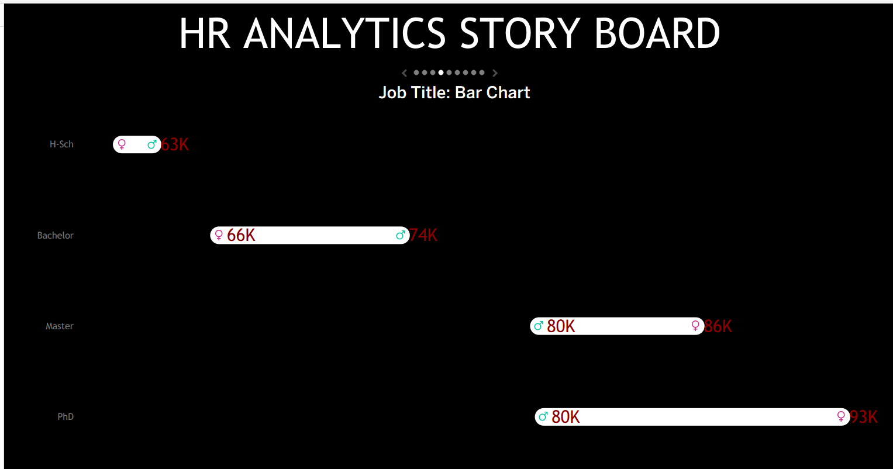
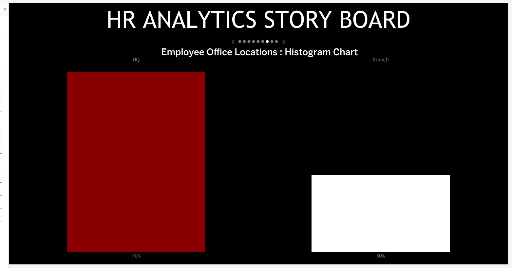
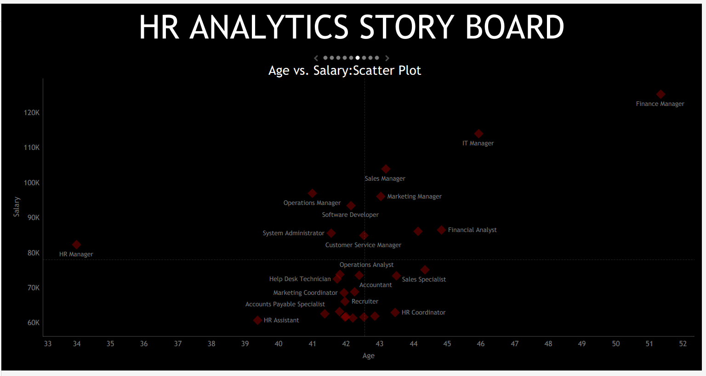

# HR Workforce Analytics Dashboard

An interactive Tableau dashboard that transforms fictional HR data into workforce insights across hiring, terminations, demographics, compensation, job roles, education, and geography.

[**View the interactive dashboard on Tableau Public**](https://public.tableau.com/app/profile/steve.o.a/viz/HRDashboard_17909717904240/HRDetails)

> **Data disclosure:** This portfolio project uses fictional/synthetic HR data. It demonstrates analytics, data visualization, and storytelling capabilities; it does not represent a real organization or employee population.

## Dashboard Preview


## Project Overview

This project organizes workforce information into an interactive decision-support dashboard. It enables exploration of workforce composition, hiring and termination activity, compensation patterns, job-title distribution, education levels, and employee-location trends.

## Business Questions

- Which departments and job titles account for the highest hiring volume?
- How do hires and terminations vary by department and workforce segment?
- How is the workforce distributed across headquarters, branches, and states?
- What patterns appear across gender, age group, and education level?
- How do average salaries vary by role, age, education level, and gender?

## Tools Used

- **Tableau** — interactive dashboards, calculated fields, filters, maps, and visual storytelling
- **Python / pandas** — data cleaning, missing-value checks, category standardization, and derived fields
- **Excel / CSV** — source-data review and preparation
- **GitHub** — version control and portfolio documentation

## Dashboard Coverage

| Area | Analysis |
|---|---|
| Department activity | Hiring and termination counts by department |
| Job-title distribution | Hiring/workforce distribution across roles |
| Location | Headquarters vs. branch distribution and state-level coverage |
| Demographics | Gender, age-group, and education-level patterns |
| Compensation | Salary comparisons by age, job title, education level, and gender |

## Dashboard Gallery

### HR Storyboard


### Department Analysis


### Job-Title Analysis



### Location Analysis



### Compensation Analysis



## Methodology

1. Reviewed the HR source data and assessed key fields such as salary, performance rating, hire date, and termination date.
2. Standardized selected categorical values and converted date fields into consistent formats.
3. Developed analytical fields including age, employment duration, salary bands, and performance-related indicators.
4. Built Tableau worksheets for departmental activity, job titles, locations, demographics, education, and compensation relationships.
5. Combined the views into an interactive Tableau dashboard and published it to Tableau Public.

## Descriptive Observations

The points below summarize patterns visible in the fictional dashboard data and are intended as examples of analytical interpretation:

- Operations has the highest displayed hiring volume, followed by Sales and Customer Service.
- Branch locations account for approximately 70% of displayed hires, while headquarters accounts for approximately 30%.
- Bachelor’s degree holders are the largest displayed education group.
- Salary levels vary across job titles, age, education level, and gender, providing useful starting points for compensation review.
- The geographic view supports workforce exploration across several U.S. states and locations.

For interpretation guidance and potential next analyses, see [Insights and Recommendations](docs/insights-and-recommendations.md).

## Project Files

| Resource | Description |
|---|---|
| [Interactive Tableau dashboard](https://public.tableau.com/app/profile/steve.o.a/viz/HRDashboard_17909717904240/HRDetails) | Published dashboard for interactive exploration |
| [Tableau packaged workbook](dashboard/HR%20Dashboard.twbx) | Downloadable Tableau workbook package |
| [HRData.csv](data/HRData.csv) | Analysis-ready fictional HR data |
| [HumanResources.csv](data/HumanResources.csv) | Fictional HR source data |
| [Project overview](docs/project-overview.md) | Business context, scope, and intended use |
| [Data dictionary](docs/data-dictionary.md) | Field groups and derived metrics |
| [Insights and recommendations](docs/insights-and-recommendations.md) | Interpretation notes and suggested next analyses |

## Repository Structure

```text
hr-workforce-analytics-dashboard/
├── dashboard/     # Tableau packaged workbook
├── data/          # Fictional HR data and project mockup
├── docs/          # Project documentation
├── images/        # Dashboard visuals
├── README.md
├── LICENSE
└── .gitignore
```

## Author

Steve Okyere Oduro-Amoyaw

Licensed under the [MIT License](LICENSE).